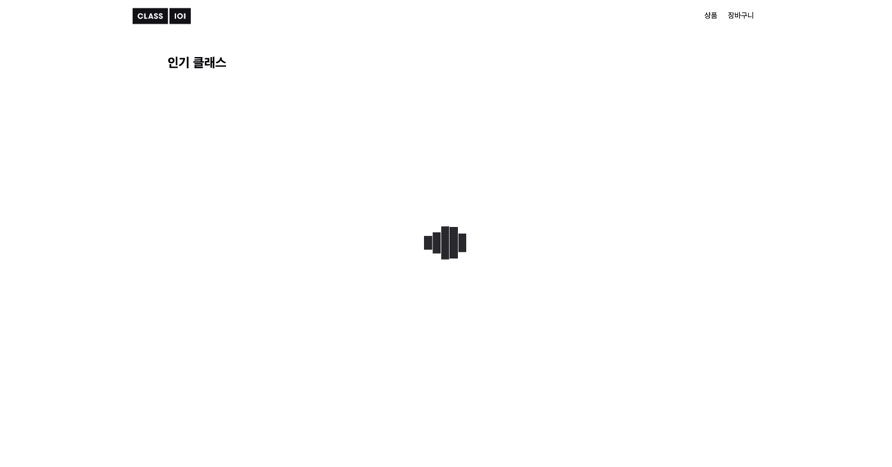
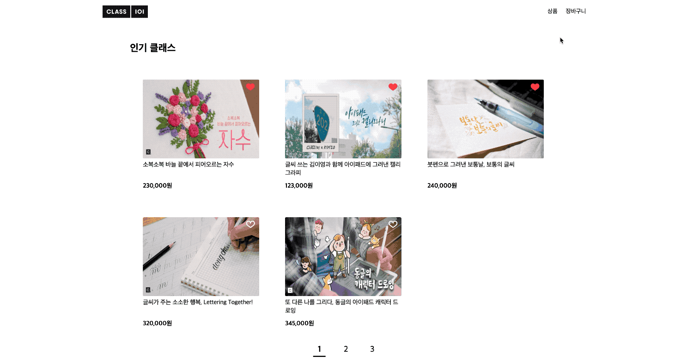

> ## Contents

- [Introduction](#Introduction)

- [Installation](#Installation)

- [Features](#Features)

- [Approach](#Approach)

- [Project Structure](#Project-Structure)

- [Learning points](#Learning-points)

> ### Introduction

- 클래스 상품목록과 장바구니를 볼 수 있는 SPA구성의 웹 어플리케이션.

- 클래스를 장바구니에 담을 수 있고 장바구니에서 결제금액을 확인 할 수 있습니다.

- Header Navigation

  

- Products Page

  

- Cart Page

  

> ### Installation

```
$git clone https://github.com/MrKamake/class101-test.git

$cd class101-test

$yarn install

$yarn start
```

> ### Features

- 페이지네이션 기능으로 상품을 5개씩 볼 수 있습니다.

- 사용자가 선택한 상품들을 장바구니에 최대 3개까지 추가하고 삭제할 수 있습니다.

- 사용자가 선택한 상품들을 전체 리스트에서도 확인할 수 있습니다.

- 장바구니 페이지에서 결제할 상품을 선택, 수량, 쿠폰 선택을 할 수 있습니다.

- 장바구니 페이지에서 결제 금액을 알 수 있습니다.

> ### Approach

1. Mock Data를 실제 Api를 호출해서 가져오는 것과 유사하게 로직을 구현해서 상품들을 랜더링했습니다.

```js
import productItems from './../mock-data/productItems';
import coupons from './../mock-data/coupons';
const data = { coupons, productItems };

const getDataApi = dataName =>
  new Promise((resolve, reject) => {
    setTimeout(() => {
      resolve(data[dataName]);
    }, 1500);
  });
```

2. Score 기준으로 내림차순 정렬시키는 기능은 `Array.prototype.reduce()`를 활용해서 productItems를 재정렬해서 구현했습니다.

```js
const [productItems, setProductItems] = useState([]);

useEffect(() => {
  getDataApi('productItems').then(res => {
    res.sort((a, b) => b.score - a.score);
    setProductItems(res);
  });
}, []);
```

> ### Project Structure

#### 1) **유지보수와 확장 용이성**

- 재사용할 수 있고 향후 유지보수하는 것에 어려움이 없지 않도록 컴포넌트를 만들었습니다. 책임분리와 적절한 의존성을 고민하며 컴포넌트들의 전반적인 구조를 고민했습니다.

#### 2) React Router

```js
// 초기 랜더링 될때 Redirect를 사용해서 Path를 "/products"으로 변경해서 명확한 주소로 사용자가 알아 볼 수 있도록 구현했습니다.
<Route exact path="/" render={() => <Redirect to="/products" />} />
<Route path="/products" component={Products} />

// 장바구니 페이지 랜더링
<Route path="/cart" component={Cart} />
```

#### 3) Context를 이용한 상태관리

##### - Global State

```js
import React, { createContext } from 'react';

export const CartContext = createContext();

const App = () => {
  const [cartList, setCartList] = useState([]);

  return (
    <CartContext.Provider value={{ cartList, setCartList }}>
      <Component />
    </CartContext.Provider>
  );
};
```

> ### Learning Points

- **시간 관리**

  : 과제를 받고 나서 마음이 급했던 것은 사실입니다. 하지만 코딩을 무작정 시작하기보다 대략적인 큰 틀을 설계하고 테스크를 리스트업해서 할 수 있는 작은 것부터 해결했습니다. 제한된 시간 내에 요구 사항을 완성하기 위해서 기능 구현을 먼저 빠르게 했습니다. UI/UX를 고려하며 스타일을 구성하면서 구현완성된 기능들을 유지보수와 컴포넌트 재사용을 고려하며 구조적인 리팩토링을 했습니다. 현업의 상황과 크게 다르지 않을 것이라고 생각합니다. 이번 과제를 통해서 역량에 따른 시간 관리를 잘 해야한다는 것을 배웠습니다.

- **구조 설계**

  : 기능 구현을 마치고 코드의 확장성을 고려했을때, 코드간의 결속성이 짙은 것을 확인했습니다. 보다 나은 컴포넌드의 구조를 생각하고 설계하고 리팩토링했습니다. 구현을 시작하기전에 더욱 깊이 고민한다면 보다 정확하고 빠른 코딩을 할 수 있다는 것을 배웠습니다.

- **git**

  : Git으로 버전 관리를 했습니다. 코딩은 혼자하는 것이 아니기에 협업을 정말 중요하게 생각합니다. 저만의 철학은 나뿐아니라 함께 협업하는 동료에게 **배려**가 있는 코드여야 한다고 생각합니다. 개발 과정 중 커밋 메세지를 더 디테일하고 명확하게 작성하지 못한 점이 아쉬웠습니다. Git을 사용하는 것에 더 신경쓰고 싶습니다.

- **Me**

  : 현재 저의 개발속도가 빠르지는 않지만 구현해내는 코드에 집중합니다. 누가봐도 읽기 쉽게 가독성이 좋고 재사용이 가능해서 확장성이 용이한 코딩을 하기위해 노력하고 있습니다. 정확하지 않게 빠르게 코딩한다면 오히려 길을 돌아가는 것이라 생각합니다. 문제를 발견하면 해결하기위해 심혈을 기울입니다. 최선을 다해 속도를 내면서 보다 정확하게 프로그래밍을 하는 개발자가 될 것입니다.

> ### Thank You

클래스101은 회사를 좋아하고 일을 즐기고 성장하는 사람들이 성과내며 일하기 좋은 회사라는 것에 매력을 더욱 느꼈습니다.</br>
저는 혼자서 개발을 하거나 Bootcamp에서 솔로 프로젝트로 개발을 했습니다.</br>
이제는 클래스101의 일원이 되어서 팀원들과 함께 좋은 영향을 서로 주고 받으며 성장하고 싶습니다.</br>
</br>
감사합니다!:blush:
